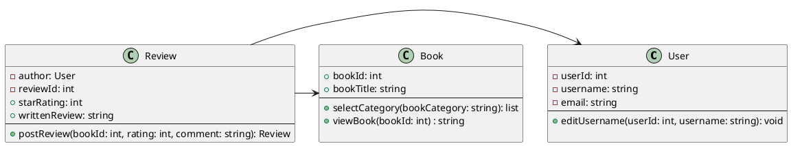

```plantuml
skin rose

@startuml

class User {
- userId: int
- username: string
- email: string
--
+ editUsername(userId: int, username: string): void 

}


class Book{
+ bookId: int 
+ bookTitle: string
--
+  selectCategory(bookCategory: string): list
+ viewBook(bookId: int) : string

}


class Review{
- author: User
- reviewId: int 
+ starRating: int 
+ writtenReview: string
--
+ postReview(bookId: int, rating: int, comment: string): Review 
}


Review -> User 
Review -> Book
  
 @enduml
```
