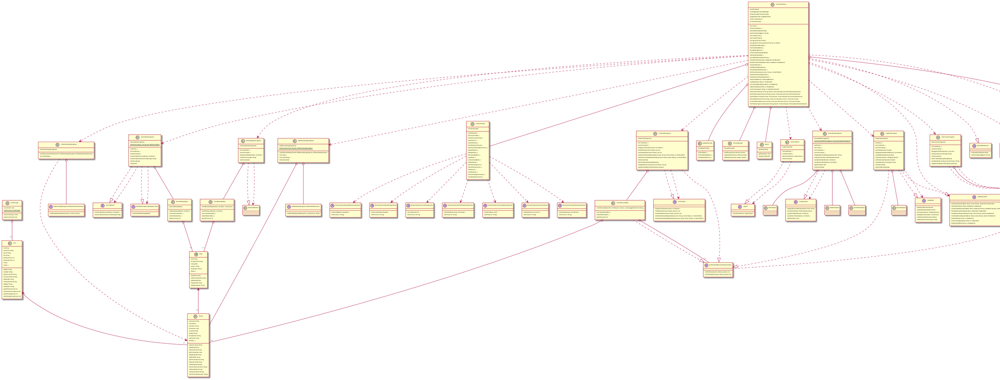

```plantuml
@startuml

skin rose
skinparam classAttributeIconSize 0
skinparam defaultFontName Arial
skinparam defaultFontSize 5

class Book {
  - title: String
  - thumbnailUrl: String
  - rating: float
  - author: String
  - description: String
  + Book(...)
  --
  + getTitle(): String
  + getThumbnailUrl(): String
  + getRating(): float
  + getAuthor(): String
  + getDescription(): String
}

class Review {
  - username: String
  - rating: float
  - comment: String
  - timestamp: Long
  - reviewId: String
  - bookId: String
  - thumbnailUrl: String
  - authorUid: String
  + Review(...)
  --
  + getUsername(): String
  + getRating(): float
  + getComment(): String
  + getTimestamp(): Long
  + getReviewId(): String
  + getBookId(): String
  + getThumbnailUrl(): String
  + getAuthorUid(): String
  + setRating(rating: float)
  + setComment(comment: String)
  + setReviewId(id: String)
  + setAuthorUid(uid: String)
  + setUsername(username: String)
}

class User {
  - id: String
  - username: String
  - email: String
  - bio: String
  - followersCount: int
  - followingCount: int
  + User()
  + User(...)
  --
  + getId(): String
  + setId(id: String)
  + getUsername(): String
  + setUsername(u: String)
  + getEmail(): String
  + setEmail(email: String)
  + getBio(): String
  + setBio(bio: String)
  + getFollowersCount(): int
  + setFollowersCount(count: int)
  + getFollowingCount(): int
  + setFollowingCount(count: int)
}

class UserManager {
  - currentUser: User
  + {static} getInstance(): UserManager
  --
  + setCurrentUser(u: User)
  + getCurrentUser(): User
}

class FirestoreFacade {
  + FirestoreFacade()
  --
  + saveNewUser(...)
  + fetchUserProfile(...)
  + fetchUsernameForUid(...)
  + searchUsers(...)
  + submitReview(...)
  + fetchReviewsForBook(...)
  + fetchUserReviewsByUsername(...)
  + updateReview(...)
  + deleteReview(...)
  + fetchSavedBooks(...)
  + saveBook(...)
  + removeSavedBook(...)
  + isBookSaved(...)
  + fetchFollowingCount(...)
  + fetchFollowersCount(...)
  + followUser(...)
  + unfollowUser(...)
  + fetchFollowingUsernames(...)
  - parseReviewDocument(...)
}

class GoogleApiFacade {
  + GoogleApiFacade()
  --
  + searchBooks(...)
  + fetchTopRatedBooks(...)
  + fetchBooksByGenre(...)
}

class ReviewManager {
  + ReviewManager()
  --
  + postReview(review: Review, listener)
  + updateReview(review: Review, listener)
  + deleteReview(review: Review, listener)
}

class ControllerActivity {
  - mainUI: MainUI
  - reviewManager: ReviewManager
  - firestoreFacade: FirestoreFacade
  - googleApiFacade: GoogleApiFacade
  - mAuth: FirebaseAuth
  + ControllerActivity()
  --
  + onCreate(...)
  + fetchSearchBooks(...)
  + onBookSelected(book: Book)
  + onGenreSelected(genre: String)
  + onCreateAccount(...)
  + onProceedToLogin()
  + onLogin(username: String)
  + onLogin(email: String, password: String, ui: LoginUI)
  + fetchWelcomeMessage(...)
  + fetchTopRatedBooks(...)
  + fetchBooksByGenre(...)
  + onSearchBooksNavigateBack()
  + onReviewSubmitted(...)
  - proceedWithReviewSubmission(...)
  + fetchReviews(book: Book, viewBookUI: ViewBookUI)
  + fetchReviewsForBook(book: Book, viewBookUI: ViewBookUI)
  + onSubmitReview(...)
  + onEditReviewRequested(...)
  + onDeleteReviewRequested(...)
  + fetchUserReviews(username: String, ui: ViewProfileUI)
  + onEditUserReviewRequested(...)
  + onDeleteUserReviewRequested(...)
  + fetchSavedBooks(ui: ViewSavedBooksUI)
  + saveBook(book: Book, ui: ViewBookUI)
  + removeSavedBook(book: Book, ui: ViewBookUI)
  + isBookSaved(book: Book, ui: ViewBookUI)
  + searchUsers(query: String, ui: ViewSearchUsersUI)
  + fetchUserProfile(userId: String, listener: FirestoreFacade_OnUserProfileFetchedListener)
  + fetchFollowingCount(userId: String, listener: FirestoreFacade_OnCountFetchedListener)
  + fetchFollowersCount(username: String, listener: FirestoreFacade_OnCountFetchedListener)
  + follow(followedUsername: String, onSuccess: Runnable, onError: Consumer<String>)
  + unfollow(followedUsername: String, onSuccess: Runnable, onError: Consumer<String>)
  + fetchFollowingUsernames(userId: String, listener: FirestoreFacade_OnFollowedListFetchedListener)
}

class MainUI {
  + MainUI(activity)
  --
  + getRootView(): View
  + displayFragment(f)
}

class LoginFragment {
  + LoginFragment()
  --
  + onCreateView(...)
  + onViewCreated(...)
  + setListener(listener: LoginListener)
  + onDestroyView()
}

class BrowseBooksFragment {
  + BrowseBooksFragment()
  + {static} newInstanceWithGenre(genre: String): BrowseBooksFragment
  --
  + onAttach(...)
  + onCreate(...)
  + onCreateView(...)
  + onViewCreated(...)
  + displayWelcomeMessage(welcomeText: String)
  + setListener(listener: BrowseBooksListener)
  + updateHotBooks(books: List<Book>)
  + updateGenreBooks(books: List<Book>)
  + getRootView(): View
  + onDestroyView()
}

class SearchBooksFragment {
  + SearchBooksFragment()
  + {static} newInstance(query: String): SearchBooksFragment
  --
  + onAttach(...)
  + onCreateView(...)
  + onViewCreated(...)
  + onSearchBooksSuccess(books: List<Book>)
  + onSearchBooksFailure(errorMessage: String)
  + onDestroyView()
  + onDetach()
}

class ViewBookFragment {
  + ViewBookFragment()
  --
  + onAttach(...)
  + onCreateView(...)
  + onViewCreated(...)
  + postReview(review: Review)
  + displayReviews(fetchedReviews: List<Review>)
  + updateBookDetails(book: Book)
  + setListener(listener: ViewBookListener)
  + onBookSaveState(saved: boolean)
  + onBookSaveError(message: String)
  + onDestroyView()
  - openPostReviewDialog()
}

class ViewSavedBooksFragment {
  + ViewSavedBooksFragment()
  --
  + onCreateView(...)
  + onViewCreated(...)
  + displaySavedBooks(books: List<Book>)
  + showError(message: String)
  + onDestroyView()
}

class SearchUsersFragment {
  + SearchUsersFragment()
  --
  + onCreateView(...)
  + onViewCreated(...)
  + displaySearchResults(users: List<User>)
  + showSearchError(message: String)
  + onDestroyView()
  - fetchProfileAndSetupFollowButton()
  - setupRealtimeCounts(usernameToQuery: String)
  - updateFollowButtonUI(isFollowing: boolean)
}

class ViewProfileFragment {
  + ViewProfileFragment()
  --
  + onCreateView(...)
  + onViewCreated(...)
  + displayUserReviews(reviews: List<Review>)
  + onEditReview(review: Review, pos: int)
  + onDeleteReview(review: Review, pos: int)
  + onEditUserReviewRequested(username: String, review: Review, ui: ViewProfileUI)
  + onDeleteUserReviewRequested(username: String, review: Review, ui: ViewProfileUI)
  + onDestroyView()
  - fetchProfileAndSetupFollowButton()
  - setupRealtimeCounts(usernameToQuery: String)
  - updateFollowButtonUI(isFollowing: boolean)
}

class PostReviewDialogFragment {
  + PostReviewDialogFragment()
  --
  + setOnReviewSubmittedListener(l: PostReviewDialogFragment_OnReviewSubmittedListener)
  + onCreateDialog(...)
}

class EditReviewDialogFragment {
  + EditReviewDialogFragment()
  + {static} newInstance(review: Review): EditReviewDialogFragment
  --
  + setOnReviewEditedListener(l: EditReviewDialogFragment_OnReviewEditedListener)
  + onCreate(...)
  + onCreateDialog(...)
  + onDestroyView()
}

class SavedBooksAdapter {
  + SavedBooksAdapter(books: List<Book>, clickListener)
  --
  + updateData(newBooks: List<Book>)
  + onCreateViewHolder(...)
  + onBindViewHolder(...)
  + getItemCount(): int
}

class SearchBooksAdapter {
  + SearchBooksAdapter()
  --
  + updateData(newBooks: List<Book>)
  + onCreateViewHolder(...)
  + onBindViewHolder(...)
  + getItemCount(): int
}

class UserReviewsAdapter {
  + UserReviewsAdapter(list: List<Review>, listener, currentLoggedInUserUid: String)
  --
  + onCreateViewHolder(...)
  + onBindViewHolder(...)
  + getItemCount(): int
}

interface BrowseBooksUI {
  + displayWelcomeMessage(welcomeText: String)
  + setListener(listener: BrowseBooksListener)
  + updateHotBooks(books: List<Book>)
  + updateGenreBooks(books: List<Book>)
  + getRootView(): View
}

interface BrowseBooksListener {
  + onBookSelected(book: Book)
  + onGenreSelected(genre: String)
}

interface CreateAccountUI {
  + setListener(listener: CreateAccountListener)
}

interface CreateAccountListener {
  + onCreateAccount(username: String, email: String, password: String, ui: CreateAccountUI)
  + onProceedToLogin()
}

interface LoginUI {
  + setListener(listener: LoginListener)
}

interface LoginListener {
  + onLogin(username: String)
  + onLogin(email: String, password: String, ui: LoginUI)
}

interface ViewBookUI {
  + postReview(review: Review)
  + updateBookDetails(book: Book)
  + setListener(listener: ViewBookListener)
  + displayReviews(reviews: List<Review>)
  + onBookSaveState(saved: boolean)
  + onBookSaveError(message: String)
}

interface ViewBookListener {
  + onReviewSubmitted(book: Book, review: Review, viewBookUI: ViewBookUI)
  + fetchReviews(book: Book, viewBookUI: ViewBookUI)
  + onSubmitReview(selectedBook: Book, newReview: Review, viewBookFragment: ViewBookFragment)
  + fetchReviewsForBook(book: Book, viewBookUI: ViewBookUI)
  + onEditReviewRequested(book: Book, review: Review, viewUI: ViewBookUI)
  + onDeleteReviewRequested(book: Book, review: Review, viewUI: ViewBookUI)
  + saveBook(book: Book, ui: ViewBookUI)
  + removeSavedBook(book: Book, ui: ViewBookUI)
  + isBookSaved(book: Book, ui: ViewBookUI)
}

interface SearchBooksUI {
  + onSearchBooksSuccess(books: List<Book>)
  + onSearchBooksFailure(errorMessage: String)
}

interface SearchBooksFragmentNavigationListener {
  + onSearchBooksNavigateBack()
}

interface ViewSearchUsersUI {
  + displaySearchResults(users: List<User>)
  + showSearchError(message: String)
}

 interface ViewProfileUI {
  + displayUserReviews(reviews: List<Review>)
  + onEditReview(review: Review, position: int)
  + onDeleteReview(review: Review, position: int)
  + onEditUserReviewRequested(username: String, review: Review, ui: ViewProfileUI)
  + onDeleteUserReviewRequested(username: String, review: Review, ui: ViewProfileUI)
}

interface UserReviewsAdapter_ReviewActionListener {
  + onEditReview(review: Review, position: int)
  + onDeleteReview(review: Review, position: int)
}

interface FirestoreFacade_OnUserProfileFetchedListener {
  + onFetched(user: User)
  + onError(error: String)
}
 interface FirestoreFacade_OnUserSearchListener {
  + onResults(users: List<User>)
  + onError(error: String)
}
 interface FirestoreFacade_OnReviewsFetchedListener {
  + onFetched(reviews: List<Review>)
  + onError(error: String)
}
 interface FirestoreFacade_OnSavedBooksFetchedListener {
  + onFetched(books: List<Book>)
  + onError(error: String)
}
 interface FirestoreFacade_OnBookSaveOpListener {
  + onSuccess(isSaved: boolean)
  + onError(error: String)
}
 interface FirestoreFacade_OnCountFetchedListener {
  + onCount(count: int)
  + onError(error: String)
}
 interface FirestoreFacade_OnFollowedListFetchedListener {
  + onFetched(usernames: List<String>)
  + onError(error: String)
}

interface PostReviewDialogFragment_OnReviewSubmittedListener {
  + onReviewSubmitted(rating: float, comment: String)
}

interface EditReviewDialogFragment_OnReviewEditedListener {
  + onReviewEdited(newRating: float, newComment: String)
}

class FirebaseAuth << (S,#ADD8E6) Singleton >>
class FirebaseFirestore << (S,#ADD826) Singleton >>
class ListenerRegistration

Book "1" <-- "0..*" Review
User "1" <-- "0..*" Review
UserManager o-- "0..1" User
ControllerActivity ..|> BrowseBooksListener
ControllerActivity ..|> CreateAccountListener
ControllerActivity ..|> LoginListener
ControllerActivity ..|> ViewBookListener
BrowseBooksFragment ..|> BrowseBooksUI
CreateAccountFragment ..|> CreateAccountUI
LoginFragment ..|> LoginUI
ViewBookFragment ..|> ViewBookUI
ViewBookFragment ..|> UserReviewsAdapter_ReviewActionListener
SearchBooksFragment ..|> SearchBooksUI
SearchBooksFragment ..|> SearchBooksFragmentNavigationListener
ViewSavedBooksFragment ..|> ViewSavedBooksUI
SearchUsersFragment ..|> ViewSearchUsersUI
ViewProfileFragment ..|> ViewProfileUI
ViewProfileFragment ..|> UserReviewsAdapter_ReviewActionListener
UserReviewsAdapter ..|> UserReviewsAdapter_ReviewActionListener
SearchUsersAdapter +.. UserReviewsAdapter_ReviewActionListener

ControllerActivity o-- MainUI
ControllerActivity o-- ReviewManager
ControllerActivity o-- FirestoreFacade
ControllerActivity o-- GoogleApiFacade
ControllerActivity o-- FirebaseAuth

ControllerActivity ..> LoginFragment
ControllerActivity ..> BrowseBooksFragment
ControllerActivity ..> SearchBooksFragment
ControllerActivity ..> ViewBookFragment
ControllerActivity ..> ViewSavedBooksFragment
ControllerActivity ..> SearchUsersFragment
ControllerActivity ..> ViewProfileFragment
ControllerActivity ..> PostReviewDialogFragment
ControllerActivity ..> EditReviewDialogFragment

LoginFragment ..> LoginUI
BrowseBooksFragment ..> BrowseBooksUI
SearchBooksFragment ..> SearchBooksUI
SearchBooksFragment ..> SearchBooksFragmentNavigationListener
ViewBookFragment ..> ViewBookUI
ViewBookFragment ..> ViewBookListener
ViewSavedBooksFragment ..> ViewSavedBooksUI
SearchUsersFragment ..> ViewSearchUsersUI
ViewProfileFragment ..> ViewProfileUI

BrowseBooksFragment o-- HotBookAdapter
BrowseBooksFragment o-- GenreBookAdapter
BrowseBooksFragment o-- GenreAdapter
SearchBooksFragment o-- SearchBooksAdapter
ViewBookFragment o-- ReviewsAdapter
ViewSavedBooksFragment o-- SavedBooksAdapter
SearchUsersFragment o-- SearchUsersAdapter
ViewProfileFragment o-- UserReviewsAdapter

SavedBooksAdapter o-- "0..*" Book
SearchBooksAdapter o-- "0..*" Book
UserReviewsAdapter o-- "0..*" Review

UserReviewsAdapter o-- "0..1" UserReviewsAdapter_ReviewActionListener

PostReviewDialogFragment o-- PostReviewDialogFragment_OnReviewSubmittedListener
PostReviewDialogFragment ..> Review
EditReviewDialogFragment o-- EditReviewDialogFragment_OnReviewEditedListener
EditReviewDialogFragment o-- Review

FirestoreFacade ..> FirestoreFacade_OnUserProfileFetchedListener
FirestoreFacade ..> FirestoreFacade_OnUserSearchListener
FirestoreFacade ..> FirestoreFacade_OnReviewsFetchedListener
FirestoreFacade ..> FirestoreFacade_OnSavedBooksFetchedListener
FirestoreFacade ..> FirestoreFacade_OnBookSaveOpListener
FirestoreFacade ..> FirestoreFacade_OnCountFetchedListener
FirestoreFacade ..> FirestoreFacade_OnFollowedListFetchedListener


@enduml
```
