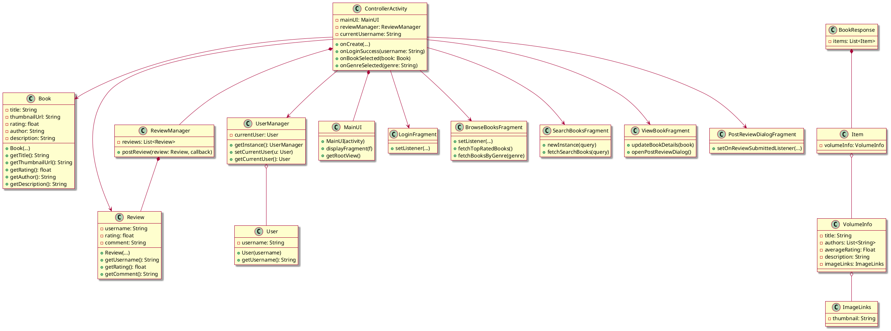

```plantuml
@startuml

skin rose
'— Model layer —
class Book {
  - title: String
  - thumbnailUrl: String
  - rating: float
  - author: String
  - description: String
  + Book(...)
  + getTitle(): String
  + getThumbnailUrl(): String
  + getRating(): float
  + getAuthor(): String
  + getDescription(): String
}

class Review {
  - username: String
  - rating: float
  - comment: String
  + Review(...)
  + getUsername(): String
  + getRating(): float
  + getComment(): String
}

class ReviewManager {
  - reviews: List<Review>
  + postReview(review: Review, callback)
}

class User {
  - username: String
  + User(username)
  + getUsername(): String
}

class UserManager {
  - currentUser: User
  + getInstance(): UserManager
  + setCurrentUser(u: User)
  + getCurrentUser(): User
}

'— API response layer —
class BookResponse {
  - items: List<Item>
}

class Item {
  - volumeInfo: VolumeInfo
}

class VolumeInfo {
  - title: String
  - authors: List<String>
  - averageRating: Float
  - description: String
  - imageLinks: ImageLinks
}

class ImageLinks {
  - thumbnail: String
}

'— UI / Controller layer —
class ControllerActivity {
  - mainUI: MainUI
  - reviewManager: ReviewManager
  - currentUsername: String
  + onCreate(...)
  + onLoginSuccess(username: String)
  + onBookSelected(book: Book)
  + onGenreSelected(genre: String)
}

class MainUI {
  + MainUI(activity)
  + displayFragment(f)
  + getRootView()
}

class LoginFragment {
  + setListener(...)
}

class BrowseBooksFragment {
  + setListener(...)
  + fetchTopRatedBooks()
  + fetchBooksByGenre(genre)
}

class SearchBooksFragment {
  + newInstance(query)
  + fetchSearchBooks(query)
}

class ViewBookFragment {
  + updateBookDetails(book)
  + openPostReviewDialog()
}

class PostReviewDialogFragment {
  + setOnReviewSubmittedListener(...)
}

'— Associations —
ReviewManager *-- Review
UserManager o-- User

BookResponse *-- Item
Item o-- VolumeInfo
VolumeInfo o-- ImageLinks

ControllerActivity *-- MainUI
ControllerActivity *-- ReviewManager
ControllerActivity --> UserManager
ControllerActivity --> Book
ControllerActivity --> Review

ControllerActivity --> LoginFragment
ControllerActivity --> BrowseBooksFragment
ControllerActivity --> SearchBooksFragment
ControllerActivity --> ViewBookFragment
ControllerActivity --> PostReviewDialogFragment

@enduml
```
