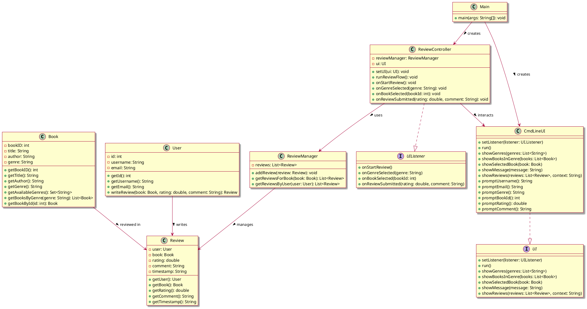

```plantuml

@startuml
skin rose 
class Book {
    - bookID: int
    - title: String
    - author: String
    - genre: String
    + getBookID(): int
    + getTitle(): String
    + getAuthor(): String
    + getGenre(): String
    + getAvailableGenres(): Set<String>
    + getBooksByGenre(genre: String): List<Book>
    + getBookById(id: int): Book
}

class User {
    - id: int
    - username: String
    - email: String
    + getId(): int
    + getUsername(): String
    + getEmail(): String
    + writeReview(book: Book, rating: double, comment: String): Review
}

class Review {
    - user: User
    - book: Book
    - rating: double
    - comment: String
    - timestamp: String
    + getUser(): User
    + getBook(): Book
    + getRating(): double
    + getComment(): String
    + getTimestamp(): String
}

class ReviewManager {
    - reviews: List<Review>
    + addReview(review: Review): void
    + getReviewsForBook(book: Book): List<Review>
    + getReviewsByUser(user: User): List<Review>
}


interface UI {
    + setListener(listener: UIListener)
    + run()
    + showGenres(genres: List<String>)
    + showBooksInGenre(books: List<Book>)
    + showSelectedBook(book: Book)
    + showMessage(message: String)
    + showReviews(reviews: List<Review>, context: String)
}

interface UIListener {
    + onStartReview()
    + onGenreSelected(genre: String)
    + onBookSelected(bookId: int)
    + onReviewSubmitted(rating: double, comment: String)
}

class CmdLineUI {
    + setListener(listener: UI.Listener)
    + run()
    + showGenres(genres: List<String>)
    + showBooksInGenre(books: List<Book>)
    + showSelectedBook(book: Book)
    + showMessage(message: String)
    + showReviews(reviews: List<Review>, context: String)
    + promptUsername(): String
    + promptEmail(): String
    + promptGenre(): String
    + promptBookId(): int
    + promptRating(): double
    + promptComment(): String
}

class ReviewController {
    - reviewManager: ReviewManager
    - ui: UI
    + setUI(ui: UI): void
    + runReviewFlow(): void
    + onStartReview(): void
    + onGenreSelected(genre: String): void
    + onBookSelected(bookId: int): void
    + onReviewSubmitted(rating: double, comment: String): void
}

class Main {
    + main(args: String[]): void
}
Main --> ReviewController : creates >
Main --> CmdLineUI : creates >
User --> Review : writes >
Book --> Review : reviewed in >
ReviewManager --> Review : manages >
CmdLineUI ..|> UI
ReviewController ..|> UIListener
ReviewController --> CmdLineUI : interacts >
ReviewController --> ReviewManager : uses >

@enduml

```
