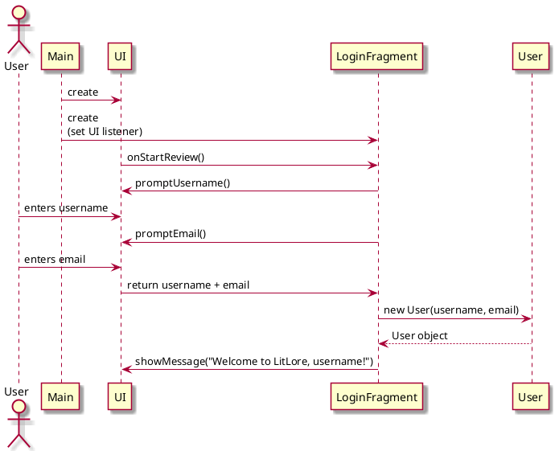

## Authenticate User
---

## **1. Primary Actor and Goals**

### **Primary Actor**:
- **User**: Users or prospective users who want to login/create account 

### **Goals**:
- Allow users to create account.
- Allow users to login if they already have an existing account.

---

## **2. Preconditions**

1. The user must own proper email address, username and password if any.
2. If not, they must create those to be able to create an account

---

## **3. Postconditions**

### **Successful Completion**:
1. If the login is successful, user will be able to view the "Home" - landing page.

### **Failure Scenarios**:
- If an error occurs while logging in or creating an account:
    - Display an appropriate error message (e.g. "Invalid Credentials",
      "Unable to process the request. Please try again.")

## 4.  Workflow
````plantuml
@startuml

skin rose

title Login 

|#application|User|
|#technology|System|

|System|
start
repeat

:Display the login page;

|User|
:Enter email and password;


|System|
backward: Invalid Credentials;
: Check if the credentials are valid;
repeat while (Valid?) is (no)
-> yes;
    : Display "Home" - landing page;

|User|
: View "Home" - landing page;
stop
@enduml
`````
````plantuml
@startuml

skin rose

title Sign-up/Create an account

|#application|User|
|#technology|System|

|System|
: Display "Create Account" page;

|User|
: Enter email and create password;

|System|
: Display "Account created!" message;
: Display "Home" - landing page;

|User|
: View "Home" - landing page;
stop
@enduml
`````
## 5. Sequence Diagrams


