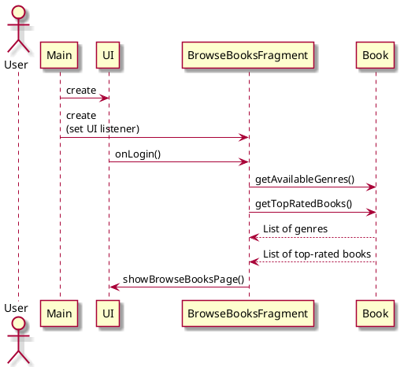

# Browse Books

## 1. Primary actor and goals
__Primary Actor__:

* __User__(Registered): Intends to view all the books available.

__Goals__:
* Allow users to seamlessly view all the books 
available in our system arranged in some kind of order/categories
* 
## 2. Preconditions
* User must be registered and authenticated (logged in).

## 3. Postconditions

The system ensures the following upon successful completion of this use case:
* The user's details are saved and can be used the next the user wants to
access the app.

## 4. Workflow
__Fully-dressed workflow diagram__:

## Sequence Diagram

