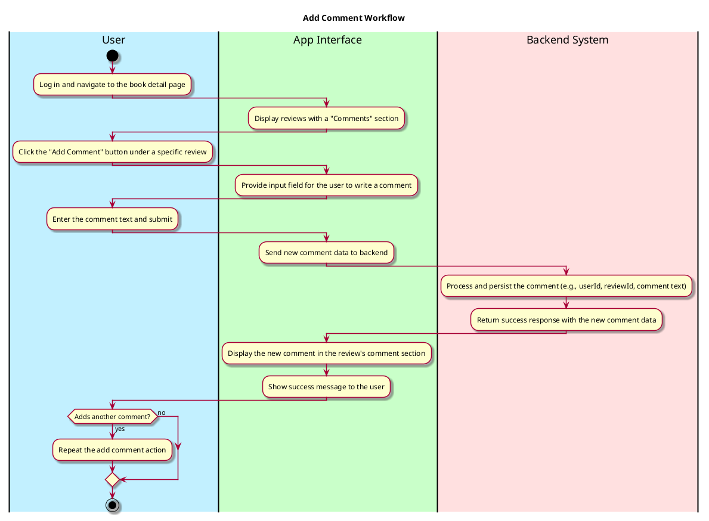
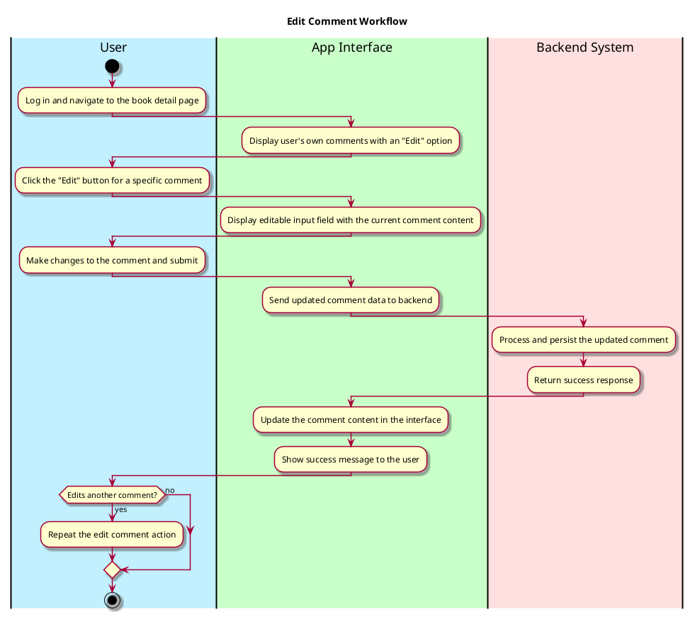
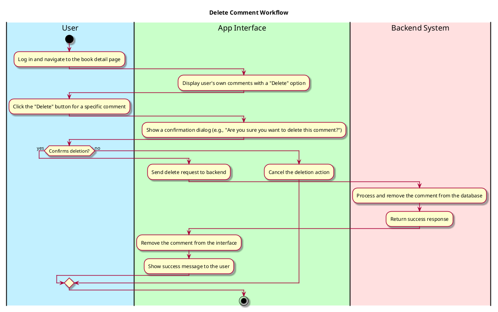

# Comment-on-a-Review Use Case

---

## **1. Primary Actor and Goals**

### **Primary Actor**:
- **User**: Users who want to add comments to a review or 
manage (edit/delete) their own comments.

### **Goals**:
- Allow users to add a comment to a specific review.
- Allow users to edit their own comments if needed.
- Allow users to delete their comments if they no longer want them displayed.
- Ensure all changes (add/edit/delete) are reflected in real-time.

---

## **2. Preconditions**

1. The user must be logged into the system (authenticated).
2. The user must have navigated to the **Book Detail Page** 
and selected a review to comment on.
3. The user must have permission to edit or delete 
their own comments on a review.

---

## **3. Postconditions**

### **Successful Completion**:
1. If the user adds a comment:
    - The comment is successfully added to the selected review.
    - The system persists the comment and reflects it 
in the review's comment section.
2. If the user edits a comment:
    - The comment is successfully updated with the new content.
    - The system persists the updated comment and reflects the 
changes on the interface.
3. If the user deletes a comment:
    - The comment is completely removed from the system and no 
longer displayed in the review's comment section.

### **Failure Scenarios**:
- If an error occurs while adding, editing, or deleting 
a comment:
    - Display an appropriate error message (e.g., 
"Unable to process the request. Please try again.") and 
retain the current state temporarily.

---

## **4. Workflow**

### 4.1 **Primary Workflow (Adding a Comment)**

---

### 4.2 **Primary Workflow (Editing a Comment)**

---

### 4.3 **Primary Workflow (Deleting a Comment)**
