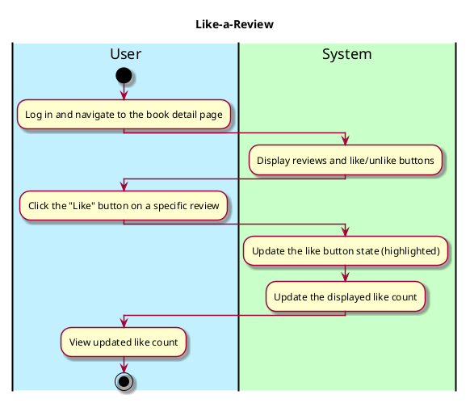

# Like-a-Review Use Case

---

## **1. Primary Actor and Goals**

### **Primary Actor**:
- **User**: Users to like reviews written by other users

### **Goals**:
- Enable users to like reviews on a book's detail page.
- Allow users to undo their "like" if clicked by mistake.
- Show the total count of likes for each review in real-time.

---

## **2. Preconditions**

1. The user must be logged into the system (authenticated).
2. The user must have navigated to the **Book Detail Page**, 
where reviews are displayed.

---

## **3. Postconditions**

### **Successful Completion**:
1. When the user clicks the "Like" button on a review:
    - The button updates visually (e.g., highlighted or filled) 
to reflect the user's like.
    - The number of likes for the review increments in real-time.
    - The system persists this interaction for the user and the review.

2. If the user undoes the "Like":
    - The button resets to the unliked state.
    - The like count decrements in real-time.

---

## **4. Workflow**

### 4.1 **Primary Workflow**

