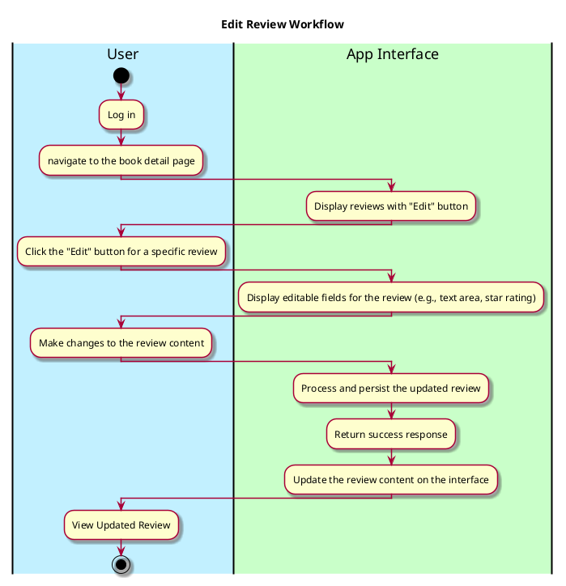
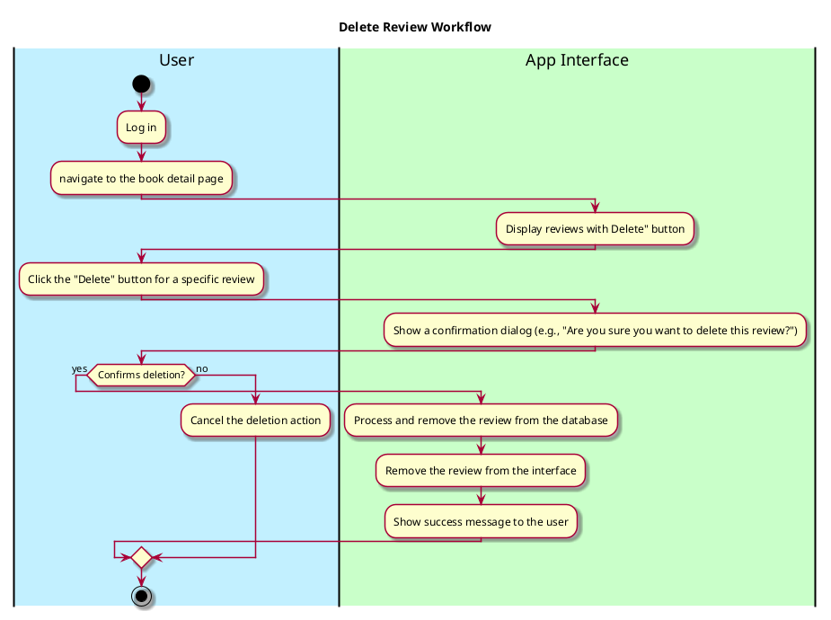

# Manage-Review Use Case

---

## **1. Primary Actor and Goals**

### **Primary Actor**:
- **User**: Users who want to edit or delete their own reviews.

### **Goals**:
- Allow users to edit their previously submitted reviews.
- Allow users to delete their reviews if they no longer want them to be displayed.
- Ensure the changes (edit or deletion) persist in real-time.

---

## **2. Preconditions**

1. The user must be logged into the system (authenticated).
2. The user must have navigated to the **Book Detail Page** and the specific review they created must be displayed.
3. The user must have permission to edit or delete their own reviews.

---

## **3. Postconditions**

### **Successful Completion**:
1. If the user edits a review:
    - The review text and/or rating is successfully updated.
    - The system persists the updated review and reflects the changes on the interface.
2. If the user deletes a review:
    - The review is completely removed from the system.
    - The book's review section updates to reflect the removal of the review.

### **Failure Scenarios**:
- If an error occurs while editing or deleting a review:
    - Display an appropriate error message (e.g., "Unable to process the request. Please try again.") and retain the original review state temporarily.

---

## **4. Workflow**

### 4.1 **Primary Workflow (Editing a Review)**

---

### 4.2 **Primary Workflow (Deleting a Review)**
