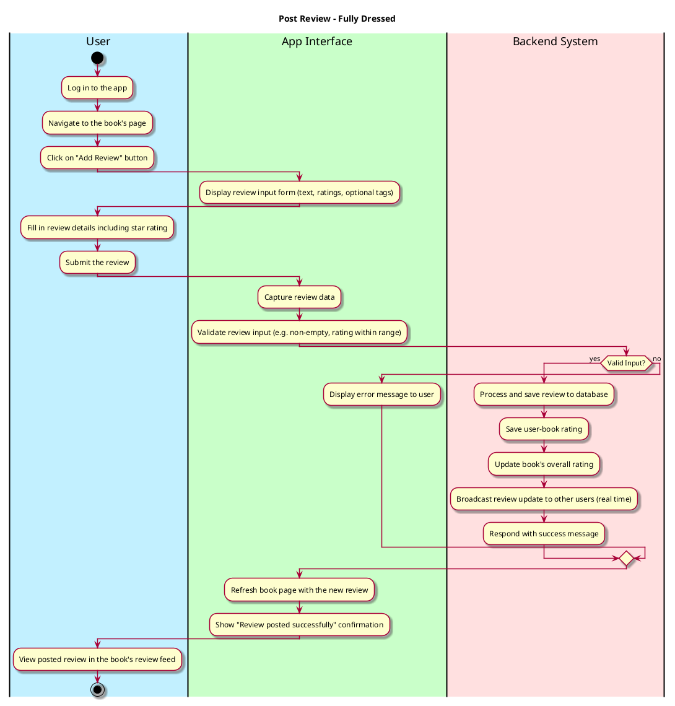

# Post Review

## 1. Primary actor and goals
__Primary Actor__:

* __User__(Registered): Intends to post a review for a book they have read.
* Wants an intuitive and fast review posting experience with real-time updates after submission.

__Goals__:
* Allow users to seamlessly post reviews for books within the app while ensuring the input is processed, validated, and displayed instantly.

## 2. Preconditions
* User must be registered and authenticated (logged in).
* The book for which the review is being posted exists in the app's database. 
* The app has an active internet connection to post the review to the server backend.

## 3. Postconditions

The system ensures the following upon successful completion of this use case:
* The review is saved in the database against the book and user profile. 
* The review becomes visible to other users in real-time. 
* Any associated rating with the review (e.g., a star rating) 
updates the book's average rating. 
* Optionally, trigger notifications to friends/followers of this activity.

__Failure Scenarios__:
* If the review cannot be saved due to network or server issues, 
the app must notify the user and prompt the to retry.

## 4. Workflow
__Fully-dressed workflow diagram__:

