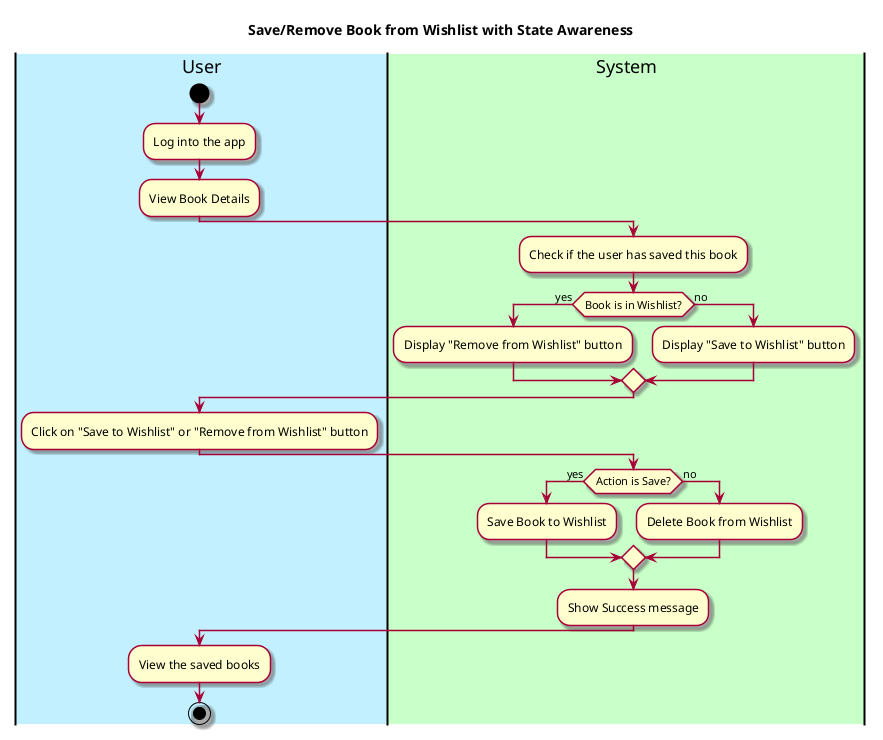

## 1. Primary Actor and Goals
**Primary Actor**:
- **User**: Seeks to save or remove books from their wishlist for later review, rating.

**Goals**:
- Allow users to save books to their wishlist with a single action (e.g., clicking a button).
- Allow users to remove books from their wishlist using the same toggle mechanism.
- Provide immediate feedback about the success of the action.
- Update the interface dynamically to reflect whether a book is in the wishlist.

## 2. Preconditions
- The user must be logged into the application.
- The user is browsing books (e.g., on a book detail page, search-for-books bar)

## 3. Post conditions
### **Successful Completion**:
1. If the user clicks **Save to Wishlist**, the book is added to their "wishlist" and the button text/icon updates to **Remove from Wishlist**.
2. If the user clicks **Remove from Wishlist**, the book is removed from their "wishlist," and the button text/icon updates back to **Save to Wishlist**.

### **Failure Scenarios**:
1. If there’s an issue (e.g., local storage is full) during the save/remove action:
    - Display an error message like _"Unable to update wishlist. Please try again."_

## 4. Workflow
The following workflow illustrates the process:


## Sequence Diagram 

````plantuml
@startuml
skin rose

actor User
participant ViewBookFragment
participant ControllerActivity
participant FirestoreFacade

'--- Save Book Flow ---
User -> ViewBookFragment      : click Save button
ViewBookFragment -> ControllerActivity : saveBook(selectedBook, this)
activate ControllerActivity

ControllerActivity -> FirestoreFacade : saveBook(uid, selectedBook, listener)
activate FirestoreFacade

FirestoreFacade --> ControllerActivity : onSuccess(true)
deactivate FirestoreFacade

ControllerActivity --> ViewBookFragment : onBookSaveState(true)
deactivate ControllerActivity

ViewBookFragment -> ViewBookFragment : update Save button UI to “Saved”
@enduml
````


