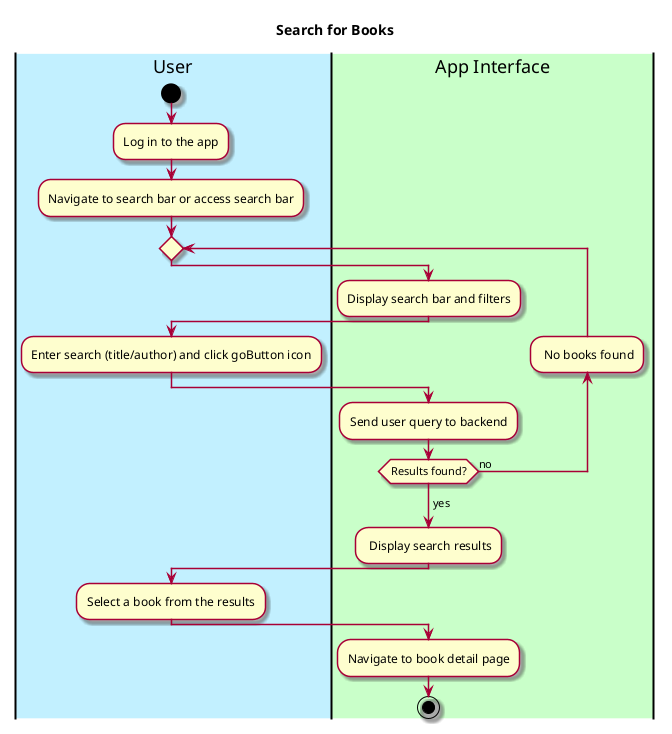

# Search For Books

## 1. Primary actor and goals

**Primary Actor**:
- **User**: Seeks to find books to review, rate, comment on, or save to their wishlist.

**Goals**:
- Search for books based on various criteria 
(e.g., title, author, keywords).
- Return a list of books that closely match the search criteria.
- Quickly navigate to books of interest and view their details
such as reviews, ratings, and metadata.

## **2. Preconditions**
- The user must be a registered and authenticated (logged in).
- The user must have access to the **Search Page** or 
a **Search Bar** within the app.

## **3. Postconditions**
### **Successful Completion**:
1. The user is presented with accurate and relevant search results 
based on their query.
2. The user can click on a search result to view details 
of the book (e.g., reviews, ratings, description, etc.).

### **Failure Scenarios**:
- If no results match the query:
    - The system displays a message like "No books found. 
  Please refine your search."

- If an error occurs:
    - Display an appropriate error message and prompt the user to retry.

## **4. Workflow**

