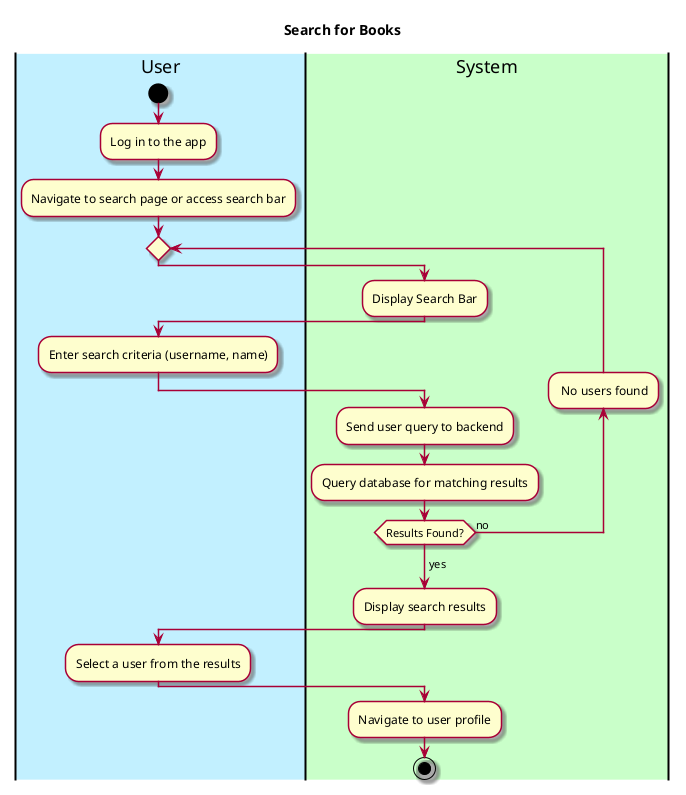

# Search For Users

## 1. Primary Actor and Goals

**Primary Actor**:
- **User**: Seeks to locate specific users within the system to see others' profile

**Goals**:
- Search for users based on username.
- Return a list of users matching the search parameters.
- View and interact with additional details of a user, such as their profile.

## 2. Preconditions
- The user must be logged into the system.

## 3. Postconditions
### **Successful Completion**:
1. The user is presented with an accurate and relevant list of users matching the search criteria.
2. The user can navigate to specific user details for further view (viewing their profile)

### **Failure Scenarios**:
- If no matching users exist:
    - Display a message like "No users found"

## 4. Workflow
