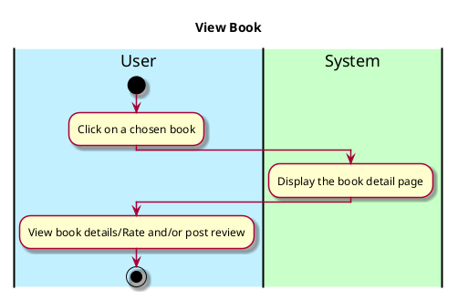

# View Book

## 1. Primary actor and goals

**Primary Actor**:
- **User**: Seeks to see book details to learn more about the book they are looking for

**Goals**:
- See/read book's details (e.g., description, genre, author).

## **2. Preconditions**
- The user must be a registered and authenticated (logged in).
- The user must have looked up and accessed a specific book they want to review

## **3. Postconditions**
### **Successful Completion**:
1. The user is presented with the details (description) of the book

### **Failure Scenarios**:
- No such scenarios since users just view the book details that are already stored in the system

## **4. Workflow**

